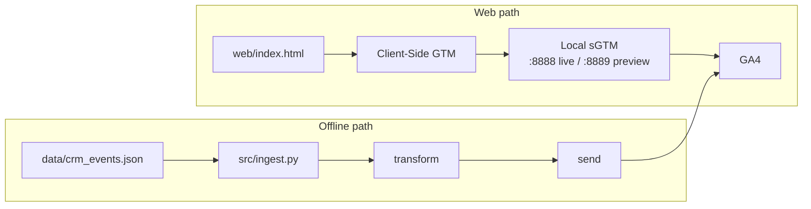

# Senior Analytics Specialist Challenge

**Data Engineering & Analytics**

> **Start here:** Review this repository on GitHub, then **fork it** to your account before making any changes. See [Submission](#submission) and [Getting Started](#getting-started).

---

## Submission

1. **Fork this repository** on GitHub to your own account. All work must be done in **your fork** — do not push branches or commits directly to the upstream repo.
2. Clone your fork locally and complete the challenge parts below.
3. Copy `LOG.md.example` → `LOG.md` and fill it in completely.
4. Invite the hiring team's GitHub handles as **collaborators on your fork** when ready for review.

**Upstream repository:** [github.com/MightyHive/int-sr-sollutions-engineer-data-challenge](https://github.com/MightyHive/int-sr-sollutions-engineer-data-challenge)

### What we review

- Code quality
- Security
- Reproducibility
- LOG.md

---

## Repository Structure

```
├── README.md
├── LOG.md.example
├── Makefile
├── .env.example
├── data/
│   ├── crm_events.json      # Part 1 — offline CRM events
│   ├── ad_spend.csv         # Part 1 — sample ad spend (CRM campaign names)
│   ├── ga4.csv              # Part 2 — GA4 event export
│   ├── google_ads.csv       # Part 2 — Google Ads daily metrics
│   └── meta.csv             # Part 2 — Meta daily metrics
├── docker/
│   ├── docker-compose.yml
│   ├── nginx.conf
│   └── generate-ssl.sh
├── web/
│   └── index.html
├── src/
│   ├── ingest.py
│   ├── transform.py
│   └── send_ga4.py
└── tests/
    └── test_transform.py
```

---


## Challenge Parts

---


### Part 1 — Conversion Tracking


#### Architecture




#### 1.1 — Infrastructure & Container Setup

**Goal:** Provision your own GTM containers and run the local sGTM stack.

> The repo ships a local sGTM **infrastructure** stack (Docker + HTTPS proxy). It does **not** include a ready-to-use GTM container configuration. Expect to create, configure, and debug your own Web and Server containers — transport URLs, clients, tags, triggers, and `CONTAINER_CONFIG` often need fixes before events flow end-to-end. Document what you changed in `LOG.md`.

**Deliverables:**

- Web and Server GTM test containers created under your Google account
- `CONTAINER_CONFIG` from your server container set in `.env`
- Local sGTM stack running (`make up`, `make health` passes)
- Server container URL registered in sGTM Admin: `https://localhost:8888`
- Client-side GTM snippet installed in `web/index.html`
- GA4 test property with Measurement Protocol credentials configured

---


#### 1.2 — Event Routing & sGTM Integration

**Goal:** Configure server-side tagging and map the test page's `dataLayer` pushes into valid GA4 events that flow client GTM → sGTM → GA4.

> Configuration issues are common here — e.g. wrong transport URL, missing GA4 Client, unpublished container versions, or a stale `CONTAINER_CONFIG` after republishing. Part of the exercise is identifying and fixing them until web events validate in GA4.

The **Simulate Purchase** and **Simulate Lead** buttons in `web/index.html` push raw `dataLayer` objects. Those pushes are **not** valid GA4 hits on their own. You must configure client-side GTM (tags, triggers, and variables) to transform them into properly structured GA4 events — including ecommerce fields for `purchase`, lead parameters for `generate_lead`, and `user_data` handling where applicable — before they reach sGTM and your property.

**Deliverables:**

- sGTM GA4 Client configured to receive incoming requests
- sGTM GA4 Tag forwarding events to your GA4 property
- Web Google Tag configured to send events to your local sGTM endpoint
- Triggers in both containers for `purchase` and `generate_lead`
- Client-side GTM configuration that maps button `dataLayer` payloads into valid GA4 events (not just console logs)
- Web events from `web/index.html` flowing through client GTM → sGTM → GA4 with correct parameters in GA4
- sGTM configuration and architecture rationale documented in `LOG.md`

---


#### 1.3 — Payload Ingestion & Code Quality

**Goal:** Build a pipeline that reads `data/crm_events.json`, transforms records into valid GA4 Measurement Protocol payloads, and sends them to your property.

**Deliverables:**

- Working `src/transform.py` and `src/send_ga4.py`
- All tests in `tests/test_transform.py` passing
- `make ingest` runs without unhandled errors
- Offline CRM events ingested via your pipeline and visible in GA4

Use public documentation for GA4 Measurement Protocol and Enhanced Conversions requirements.

---


#### 1.4 — Validation & Business Narrative

**Goal:** Prove correctness and communicate findings to stakeholders.

**Deliverables:**

- Evidence that events appear correctly in GA4
- Completed verification section in `LOG.md`
- 1-page executive summary in `LOG.md` covering what you found, what you changed, and known limitations

---


### Part 2 — Data Engineering


#### Context

XYZ is a fashion retail company running digital marketing campaigns primarily on Meta and Google Ads. To understand user behavior, top-performing pages, and purchase funnel effectiveness, they implemented Google Analytics 4 (GA4).

XYZ recently partnered with your team after leaving their previous agency due to underperformance. The Director of Marketing & Analytics is the main stakeholder. In the kickoff meeting, they shared their current tech stack and confirmed the following tables are available in Google Cloud Platform (GCP): `google_ads`, `meta`, and `ga4`.

Sample data is provided in `data/`:

- `data/google_ads.csv`
- `data/meta.csv`
- `data/ga4.csv`


#### Source Schemas

**Google Ads (`data/google_ads.csv`)**


| Field         | Description          |
| ------------- | -------------------- |
| Date          | Metric date          |
| Campaign Name | Campaign name        |
| Campaign ID   | Campaign identifier  |
| Placement ID  | Placement / creative |
| Account ID    | Account ID           |
| Account Name  | Account name         |
| Country       | Country              |
| Clicks        | Clicks               |
| Impressions   | Impressions          |
| Spend         | Spend                |


**Meta (`data/meta.csv`)**


| Field         | Description           |
| ------------- | --------------------- |
| Date          | Metric date           |
| Campaign Name | Campaign name         |
| Campaign ID   | Campaign identifier   |
| Ad Location   | Ad placement location |
| Account ID    | Account ID            |
| Account Name  | Account name          |
| Country       | Country               |
| Clicks        | Clicks                |
| Impressions   | Impressions           |
| Spend         | Spend                 |


**Google Analytics (`data/ga4.csv`)**


| Field            | Description                            |
| ---------------- | -------------------------------------- |
| User ID          | User identifier                        |
| session_id       | Session identifier                     |
| Timestamp        | Event timestamp                        |
| Event Name       | Event name                             |
| Event Parameters | Event parameters (JSON object)         |
| Campaign ID      | Attribution campaign (when applicable) |
| Stream Name      | GA4 stream                             |
| Page URL         | Page URL                               |
| Country          | Country                                |
| Is Conversion    | Conversion flag                        |


#### Questions to Answer

At the end of the session, the Director raises the following strategic and technical questions:

1. **Multi-Channel Performance & Investment:** Which advertising platform offers the best financial efficiency and overall performance across key funnel metrics (ROI, CPC, etc.)?
2. **Attribution & Campaign Effectiveness:** Which specific campaigns are driving the highest volume of conversions and revenue?
3. **Acquisition Channel Analysis:** Which traffic channels show the best overall performance when integrating on-site user behavior with ad spend?
4. **Data Model & Architecture:** What data model and intermediate/final tables should be designed in BigQuery to power these reports at scale? How do you translate these business needs into clear technical specifications for the data engineering team?


#### Deliverable

**Goal:** Produce an action plan the internal team can execute.

**Deliverables:**

- Client requirements and data transformation needs documentation
- Proposed data model (tables, relationships, key transformations)
- Approach to answering the four business questions above

---


## Getting Started

### Fork & clone

1. Open the [challenge repository](https://github.com/MightyHive/int-sr-sollutions-engineer-data-challenge) on GitHub.
2. Click **Fork** (top right) and create a fork under **your** GitHub account.
3. Clone **your fork** — not the upstream repo:

```bash
git clone https://github.com/YOUR_GITHUB_USERNAME/int-sr-sollutions-engineer-data-challenge.git
cd int-sr-sollutions-engineer-data-challenge
```

Replace `YOUR_GITHUB_USERNAME` with your GitHub handle.


### Prerequisites

- Docker Desktop (or Docker Engine + Compose)
- Python 3.10+
- A Google account (for GA4 and GTM)
- `curl` and a modern browser
- Familiarity with SQL and data modeling (Part 2)


### Local setup

From your cloned fork:

```bash
cp .env.example .env
# Edit .env with your CONTAINER_CONFIG, GA4 credentials, etc.

make up
make health
make serve-web   # serves web/index.html at http://localhost:5500
```

Local sGTM endpoints after `make up`:


| Endpoint                 | Purpose                                           |
| ------------------------ | ------------------------------------------------- |
| `https://localhost:8888` | Live server (transport URL, server container URL) |
| `https://localhost:8889` | Preview server (Tag Assistant)                    |


Your browser will warn about the self-signed certificate — accept it for local testing.

If `make health` passes but events still do not reach GA4, treat that as a configuration problem to debug (GTM Admin, browser Network tab, sGTM Preview, and your `LOG.md` blockers section) rather than an infrastructure failure.